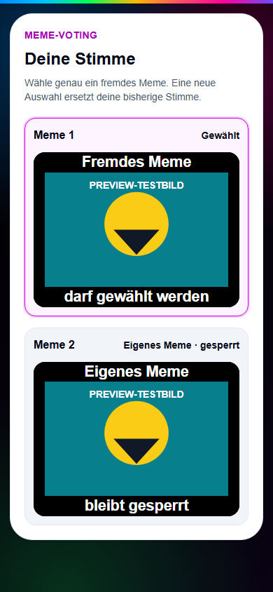
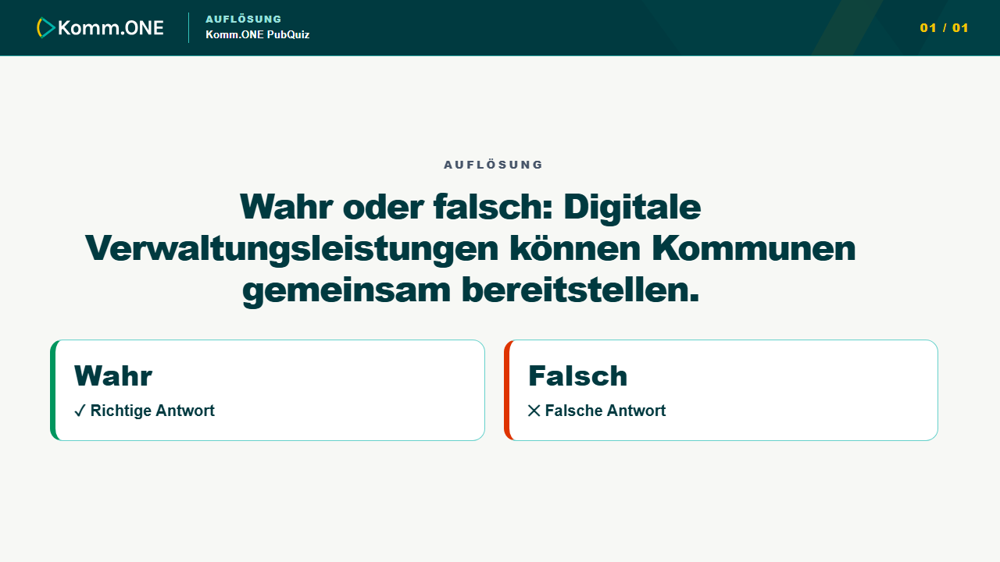
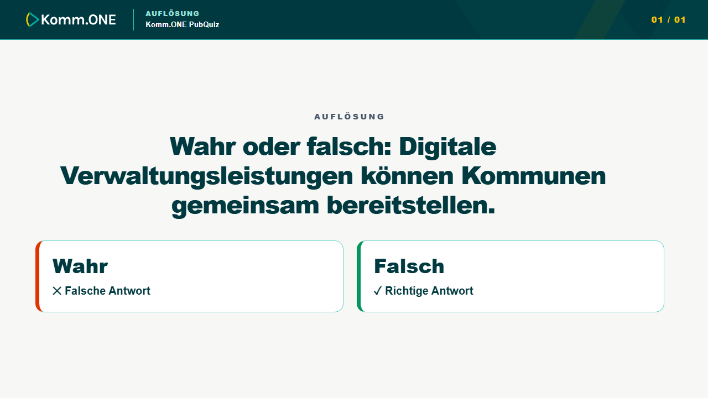

# AP 2–4 – Gemeinsame Preview-Abnahme

Stand: 2. Oktober 2026

## Abnahmebasis

- Branch: `codex/ap2-4-meme-design-webex`
- PR: [#83](https://github.com/justphilgud/pubquiz-web/pull/83)
- funktionaler Preview-SHA: `d1d3c20e3b9bde0be7c4d534fc0dac1d9b17ad2c`
- geprüfter PR-Head vor der Release-Dokumentation:
  `e41e8abc24b5b0e6caae5b03f98cb092fea4d028`
- Preview: <https://pubquiz-hflysdq96-just-phil-gud.vercel.app>
- Vercel-Deployment: `dpl_C6A9UULHhNtxYxRwGn6PF89hMiof`
- primäres Testquiz: [#77 – TEST – AP2–4 Meme Voting 02.10.2026](https://pubquiz-hflysdq96-just-phil-gud.vercel.app/quiz/77)
- zusätzliches, abgelaufenes Setup-Quiz: `#76`; dort wurden wegen der bereits
  verstrichenen 60-Sekunden-Frist keine gültigen Einreichungen erzeugt.

Die Funktionsabnahme erfolgte mit drei getrennten Preview-Teams. A und B hatten
je ein ausgewähltes Meme, C kein eigenes Meme. Es wurden keine Production-Daten
gelesen, verändert oder kopiert.

## Vergleich Funktions-SHA zu PR-Head

Der vollständige Git-Vergleich
`d1d3c20e3b9bde0be7c4d534fc0dac1d9b17ad2c..e41e8abc24b5b0e6caae5b03f98cb092fea4d028`
enthält genau eine neue Datei: diesen Abnahmebericht mit 117 Zeilen. Es gibt
keine weitere Änderung an Produktcode, Tests, Konfiguration, Abhängigkeiten oder
Migrationen. Der auf Preview funktional geprüfte Stand ist damit unverändert;
eine erneute fachliche Preview-Abnahme wegen des SHA-Unterschieds war nicht
erforderlich. Die ergänzten visuellen Release-Nachweise verwenden dieselben
Produktkomponenten und Styles.

## Status je Finding

| Punkt | Status | Ursache und Änderung | Nachweis |
| --- | --- | --- | --- |
| 9 – Meme-Abstimmung | **Grün / abgenommen** | Der Teamstatus enthielt zuvor eine pauschale Abstimmungssperre, sobald ein eigenes Meme ausgewählt war. Die Berechtigung wird nun pro Kandidat anhand der unveränderlichen Eigentümer-Team-ID bestimmt. Das eigene Meme bleibt sichtbar und deaktiviert; fremde Memes bleiben wählbar. Die serverseitige `SELF_VOTE`-Sperre, Phasenprüfung und Upsert-Semantik bleiben erhalten. | Im Testquiz #77 sahen A und B jeweils das eigene Meme als „Eigenes Meme · gesperrt“ und konnten das fremde Meme wählen. C konnte beide Kandidaten wählen. Reload stellte die gespeicherte Stimme wieder her. Wiederholtes Wählen erzeugte keine Zusatzstimme; die Moderation blieb bei 3/3 Stimmen. Nach Schließen waren alle Schaltflächen gesperrt. Das Ergebnis war korrekt 2:1 und vergab einen Punkt an den Gewinner. Direkte Eigenstimme sowie Vor-/Nachphasensperre sind zusätzlich als Serverregression getestet. |
| 2 – Meme-Kontrast | **Grün / abgenommen** | Meme-Hauptfläche und Statuskasten verwendeten Schriftfarben, die nicht auf der tatsächlich gerenderten Oberfläche aufgelöst wurden. Oberflächenbezogene Theme-Tokens liefern nun kontrastgeprüfte Text-/Flächenpaare. | Reale Komm.ONE-Ergebnisfolie bei 1280×720 und 1920×1080 geprüft: Caption, Team, Stimmen, Prozent und Gewinnerhinweis vollständig sichtbar. Real-Browser-Kontrasttest deckt `NEON`, `EDITORIAL`, `KOMM_ONE`, `BIRTHDAY` und den weiterhin unterstützten `CORPORATE`-Stil ab; normaler Text ≥ 4,5:1, großer Text ≥ 3:1. |
| 3 – offene Fragen | **Grün / abgenommen** | Die offene Ergebnisfläche erbte eine für die Fläche ungeeignete helle Textfarbe. Der vorhandene Inhalt bleibt erhalten und nutzt dieselben oberflächenbezogenen Theme-Tokens. | Offene Frage in allen vier auswählbaren Preview-Designs gerendert und lesbar geprüft. Der reale Chrome-Kontrasttest prüft Titel, Status und veröffentlichte Antwortkarte zusätzlich für alle fünf unterstützten Stil-Presets. |
| 1 – Audioanzeige | **Grün / abgenommen** | Startsequenz und Audiozustände enthielten lokale Neon-/Pink-Stile. Sie verwenden nun gemeinsame Theme-Hooks. Die fehlende Datei war keine Ursache: ohne konfigurierte Intro-URL ist `/medien/audio/intro/mexico.mp3` der vorhandene, beabsichtigte Fallback. | Startsequenz des echten Komm.ONE-Testquiz bei 1280×720 geprüft; Playmarke, Rahmen und Text folgen dem Quizdesign. Audiozustand mit Datei in der Preview-Referenz bei 1280×720 und 1920×1080 geprüft. Aktivierungsdialog und bestehende Fernsteuerung blieben erhalten. |
| 4 – Labels/Badges | **Grün / abgenommen** | Legacy-Labels und der Preise-Kicker waren lokal eingefärbt. Gemeinsame semantische Klassen beziehen Farbe und Kontrast nun aus dem aktiven Theme. | Echte Preise-Folie von Quiz #77 im Komm.ONE-Design geprüft: Kicker, Überschrift und Platzfelder sind lesbar und ohne Pink-/Neon-Leck. Die übrigen aktiven Designs wurden über die Preview-Referenz kontrolliert. |
| 5 – Wahr/Falsch | **Grün / abgenommen** | Vor der Auflösung waren die beiden Bedeutungen dauerhaft grün/rot codiert. Eine kleine Präsentationsfunktion erzeugt neutrale Optionen und markiert bei der Auflösung anhand des gespeicherten `correctAnswer` statt anhand der Seite. | Vor der Auflösung sind Wahr/Falsch in der Preview gleich gewichtet. Rendererregressionen prüfen sowohl `true` als auch `false` als richtige Lösung; bei `false` erhält „Falsch“ `✓ Richtige Antwort` und „Wahr“ `✕ Falsche Antwort`. Dasselbe gilt für Storybook. Kontrast ist in allen Stil-Presets im echten Chrome geprüft. |
| 10 – Pixel-Beschriftung | **Grün / abgenommen** | Der Text ist der Default einer neu angelegten Pixel-Frage, kein globaler Präsentationsfallback. Nur dieser Erstellungsstandard wurde von „Was …“ auf „Wer ist hier zu sehen?“ geändert. | I18n-/Editorregression prüft den neuen Default. Bereits gespeicherte oder individuell formulierte Titel werden nicht überschrieben. Die Pixel-Referenz wurde im Komm.ONE-Design bei 1280×720 geprüft. Die Referenz nutzt bewusst einen individuell formulierten Titel und belegt damit zugleich dessen Bestandsschutz. |
| 8 – Webex-Audio | **Untersucht; externe Prüfung offen, nicht blockierend** | Die App verwendet auf Laptop 1 ein natives HTML-`audio`-Element. Laptop 2 sendet nur Wiedergabekommandos. Es gibt keinen Webex-, `AudioContext`-, `setSinkId`- oder Capture-Sonderpfad und keinen belegten Produktfehler. | Codepfad, Fallback, Stummschaltung und Remote-Kommandos geprüft. Der konkrete Drei-Geräte-Webex-Gegentest ist in `ap2-4-webex-audio-diagnosis-20261002.md` beschrieben und erfordert eine echte Webex-Sitzung. |

## Browser-Smoke im Detail

Im Testquiz #77 wurden zwei Memes eingereicht, moderiert, für die Präsentation
ausgewählt, von drei Teams bewertet, geschlossen und finalisiert. Die
Kandidatenpositionen blieben stabil. A konnte B wählen, B konnte A wählen und C
konnte beide fremden Kandidaten wählen. Das eigene Meme war jeweils sichtbar,
beschriftet und nativ deaktiviert. Die Abschlussphase wartete nicht auf eine
Pflichtstimme; Enthaltung bleibt fachlich zulässig.

Der gespeicherte Lauf endete mit drei gültigen Stimmen: zwei für das Meme von
Team B und eine für das Meme von Team A. Präsentation und Moderation zeigten
dieselbe Zuordnung, dieselben Teamnamen und denselben Gewinner.

Erfasste Browserbilder in der gemeinsamen Codex-Browsersitzung:

- Meme-Wahl eines Eigentümerteams mit deaktiviertem eigenem Kandidaten,
- geschlossene Wahl mit persistierter Stimme,
- Komm.ONE-Meme-Ergebnis bei 1280×720 und 1920×1080,
- Komm.ONE-Startsequenz und Playmarke bei 1280×720,
- Komm.ONE-Preise-Folie bei 1280×720,
- offene Frage, neutrale Wahr/Falsch-Folie und Audiozustand in der
  Presentation-Quality-Preview,
- Pixel-Referenz im Komm.ONE-Design.

Die Teilnehmeransicht wurde zusätzlich auf der echten Preview mit einem
expliziten Viewport von 390×844 Pixeln geprüft. Das Dokument meldete
`innerWidth = 390`, `scrollWidth = clientWidth = 375`; es gab daher keinen
horizontalen Overflow. Der folgende reproduzierbare Nachweis rendert die echte
`MemeVotingPanel`-Komponente mit den produktiven Styles bei derselben Breite.

Für Wahr/Falsch wurden beide fachlich möglichen Auflösungszustände mit dem
echten `PresentationSlideRenderer` und dem Komm.ONE-Theme bei 1280×720 gerendert.
Die korrekte Markierung folgt dem gespeicherten `correctAnswer`; sie ist nicht
an die linke oder rechte Position gebunden.

Die drei geforderten Bildnachweise sind damit vollständig. Es wurde kein
visueller Produktfehler gefunden und deshalb kein Produktcode geändert.

In der Teilnehmer- und Adminansicht trat der bereits vor diesem Patch
dokumentierte React-Hydration-Hinweis `#418` beim Wiederherstellen des
clientseitigen Kontexts auf. Die frühere AP2-Abnahme führt die bestehende
zeitabhängige Initialisierung in `ModerationClient` als Ursache auf. Der
Vergleich gegen `origin/main` bestätigt, dass PR #83 weder
`ModerationClient.tsx` noch `QuizAntwortClient.tsx` verändert. Der Hinweis ist
damit nicht durch diesen Patch entstanden; nach der Hydrierung waren Ansicht
und Aktionen korrekt. Präsentations- und Designreferenz erzeugten keine neuen
Browserfehler. Eine fachfremde Hydration-Änderung wurde nicht in PR #83
aufgenommen.

## Qualitätssicherung

- gezielte AP2/AP3-Regressionen: **52/52 grün**
- abschließende Release-Regression für Meme, Wahr/Falsch und Renderer:
  **32/32 grün**
- echte Chrome-Kontrastmessung für Meme, offene Ergebnisse und neutrale
  Wahr/Falsch-Optionen: **grün**
- vollständige lokale Suite: **687/688 grün**; ausschließlich der bekannte
  Windows-CRLF-SHA-Test eines unveränderten OpenTDB-Plans wich lokal ab
- GitHub-CI auf Linux, Push-Run `37012211634`: **grün**
- GitHub-CI auf Linux, PR-Run `37012260383`: **grün**
- Prisma Generate/Validate: **grün**
- TypeScript: **grün**
- ESLint für alle geänderten Dateien: **grün**
- Production-Build: **grün**
- `git diff --check`: **grün**
- Merge-Basis: aktuelles `origin/main`
  `fcb333f9dd39ebf0208ea3bd4622d7b17f1561d0`; PR vor der abschließenden
  Dokumentations-CI **CLEAN**

## Architektur

Die bestehende Teilnehmerkomponente bleibt für Anzeige und Absenden zuständig;
die kandidatenspezifische Berechtigungsableitung liegt in der vorhandenen
Meme-Domäne und wird vom Server wiederverwendet. Der Präsentationsrenderer
behält die fachliche Auswahl des Inhalts. Farbkontrast und semantische
Oberflächenpaare liegen im Theme, während die kleine Wahr/Falsch-Funktion nur
die Zuordnung `correctAnswer → Option` kapselt. Es entstand weder eine zweite
Rendererarchitektur noch eine designbezogene Komm.ONE-Sonderlogik für
allgemeine Inhalte.

## Kurze manuelle Abnahme

1. Testquiz #77 öffnen und über „Quiz testen“ zur letzten Meme-Auflösung
   springen; in der Präsentation Teamnamen, Stimmen und Gewinner prüfen.
2. Über den Schnellsprung „Startsequenz“ und „Preise“ wählen und den
   themegerechten Playbutton beziehungsweise das Preise-Label prüfen.
3. Die Presentation-Quality-Seite öffnen und zwischen Komm.ONE, LOVD,
   ungegoogelt Neon und Storybook sowie offenen Fragen, Wahr/Falsch, Audio und
   Pixel wechseln.
4. Für den optionalen AP4-Gegentest den separaten Drei-Geräte-Webex-Testplan
   verwenden.

## Abschluss

AP2 und AP3 sind auf dem funktionalen Preview-SHA vollständig umgesetzt und
abgenommen. AP4 ist ohne belegten Produktfehler untersucht; nur der externe
Webex-Capture-Gegentest bleibt offen und blockiert die Übergabe nicht.

`main`, Production und produktive Daten wurden nicht verändert.
