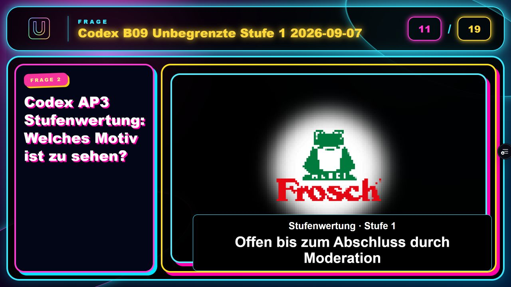
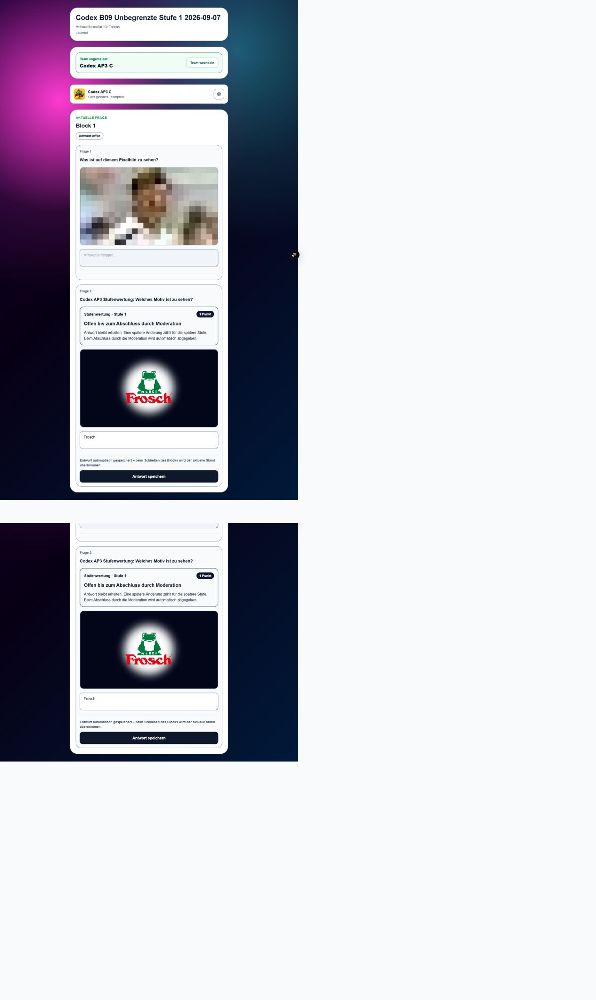
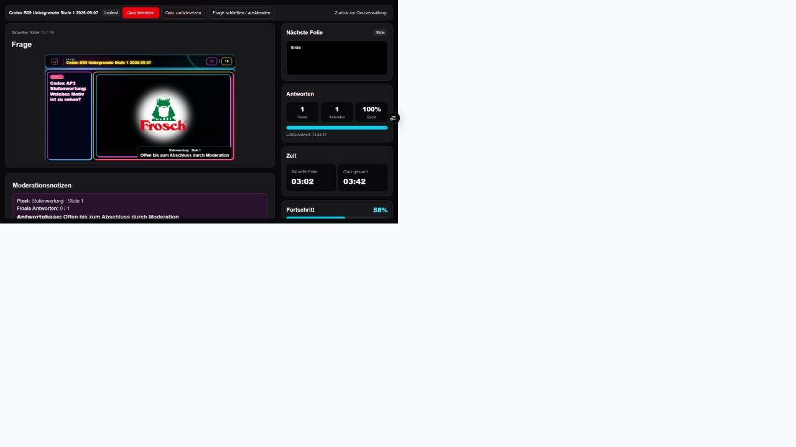
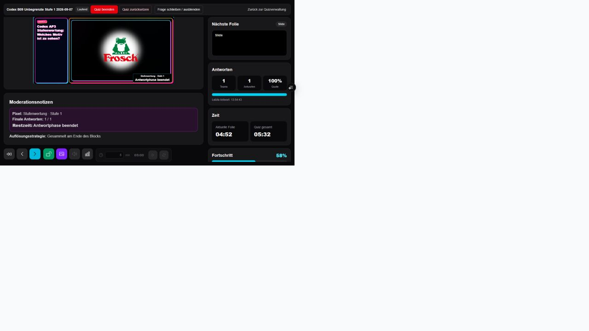
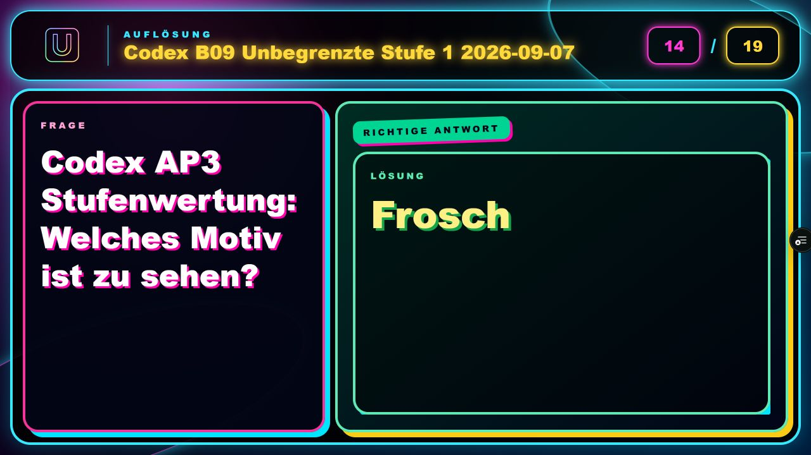
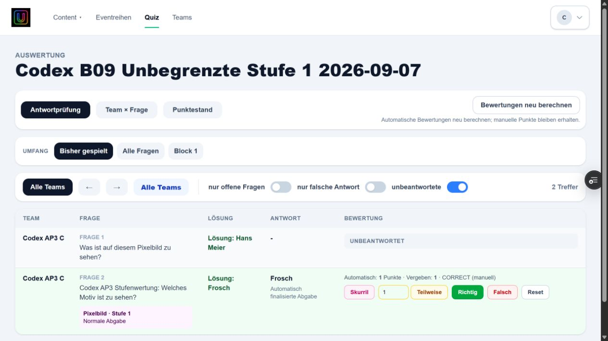

# AP3 B09 – unbegrenzte Pixel-Stufe 1

Stand: 7. September 2026. Implementierung, lokale Prüfungen, CI, Deployment und
reale Browserabnahme auf dem finalen Runtime-Commit erfolgreich abgeschlossen.

1. **Ursache:** `pixelStageEnd` erzeugte auch für die letzte STAGED-Phase eine
   Endzeit. `completedPixelStages` und der Ablaufdienst schlossen dadurch nach 60 Sekunden.
2. **Zeitlogik:** Die letzte STAGED-Phase liefert jetzt `null`; die automatische
   Grenzverarbeitung endet bei zwei. Keine künstlich entfernte Endzeit.
3. **Stufe 3:** unverändert 20 Sekunden, danach automatische Stufe 2.
4. **Stufe 2:** unverändert 20 Sekunden, danach automatische Stufe 1.
5. **Stufe 1:** unbegrenzt OPEN; Abschluss ausschließlich über vorhandene Moderation.
6. **Team:** weiterhin editierbarer Draft, statischer Offen-Status statt Countdown.
7. **Moderation:** Offen-Status statt irreführender Restzeit/„Antwortphase beendet“.
8. **Präsentation:** derselbe Offen-Status; terminale Antwortphasen bleiben unterscheidbar.
9. **Wertung:** unverändert 3/2/1; späte erste/korrigierte Antwort in Stufe 1 = 1,
   falsche Endantwort = 0. Die Dauer vermindert die Punkte nicht.
10. **Reload:** dieselbe absolute Stufe und History; kein Abschluss durch Zeitablauf.
11. **Stop/Reset:** bestehende AP1-Sperren, Finalisierung und Cascades unverändert.
12. **Challenge:** konfigurierte Dauern, letzte Deadline, Stop-Restzeit und Punktematrix unverändert.
13. **Architektur:** zentrale Zeithelfer bestimmen Endzeiten; der vorhandene
    Ablaufdienst sichert den letzten Grenzstand beim manuellen Close. Bestehende
    UI-Komponenten stellen den Zustand dar. Keine neue Engine oder Abhängigkeit.
14. **Persistenz:** keine Schemaänderung oder Migration. Das dritte numerische
    Dauerfeld bleibt kompatibel gespeichert und wird für STAGED nicht als Frist verwendet.
15. **Spezifikation:** [Living Specification](../architecture/pixel-question.md)
    einschließlich Ablaufdiagramm und PIX-INV-19 bis PIX-INV-23 aktualisiert.
16. **Tests:** vollständige Suite 1.033/1.033 erfolgreich (376 + 508 + 149).
    Gezielte Pixel-/Renderer-Suite 37/37 erfolgreich; B09 ergänzt lange Laufzeiten,
    Reload, späte Antworten, manuelle Grenzsicherung und OPEN/CLOSED-Anzeige.
17. **Qualität:** TypeScript, vollständiger ESLint, Prisma-Validierung und Next-Build
    erfolgreich. Der eingeschränkte erste Build konnte Google Fonts nicht laden;
    Wiederholung mit Netzwerkzugriff erfolgreich. Bestehende Worktree-Lockfile-Warnung.
18. **Browserabnahme:** separates Quiz 26 „Codex B09 Unbegrenzte Stufe 1 2026-09-07“,
    eigenes Team C. Automatische Wechsel 3 → 2 → 1 beobachtet. Erste richtige Antwort
    über 100 Sekunden nach beobachtetem Eintritt in Stufe 1 gespeichert. Reload
    erhält Frosch, OPEN und editierbares Feld. Spätere Änderung zu Katze und zurück
    zu Frosch akzeptiert. Moderation und Präsentation ebenfalls neu geladen:
    weiterhin Stufe 1 ohne Countdown, keine automatische Navigation oder Auflösung.
    Vor manuellem Close nach mehr als vier Minuten seit Fragenstart: 0/1 finale
    Antworten. „Block schließen“ erzeugt 1/1; Auflösung zeigt Frosch. Zentrale
    Bewertung nach Reload: Stufe 1, CORRECT, automatisch/vergeben 1 Punkt.
    Punktestand ebenfalls 1. Quiz anschließend regulär beendet; Teamzugang gesperrt.
19. **Commit/Preview:** Runtime `108f4cbc6dc7729f47166d4223645de77aa34746`,
    Branch `codex/ap3-b09`, integriert in `preview/content-and-quiz-flow`.
20. **Main/Produktion:** Main bleibt `e76f57dce19f26488cf9db24b881ab06bf004fd6`.
    Kein Produktionsdeployment angefordert oder ausgelöst. Fremde Arbeitsstände unverändert.

## Geänderte Dateien

- `app/quiz/interaction/pixelLiveInteraction.ts`: nullable Endzeit und gemeinsamer Offen-Status.
- `app/quiz/interaction/interaction.server.ts`: keine automatische letzte STAGED-Grenze.
- `app/quiz/interaction/pixelLiveInteraction.test.ts`: B09-Grenzen und Wertungsregressionen.
- `app/quiz/[quizId]/antworten/QuizAntwortClient.tsx`: offener Antwortzustand.
- `app/quiz/[quizId]/moderation/ModerationClient.tsx`: statischer Offen-Status.
- `app/rendering/presentation/PresentationSlideRenderer.tsx`: statischer Offen-Status.
- `app/rendering/presentation/PresentationSlideRenderer.test.ts`: OPEN/CLOSED-Rendervergleich.
- `app/fragen/editor/components/PixelStageTimingFields.tsx`: korrekte Zeitbeschreibung.
- `app/fragen/editor/templates/pixelRules.ts`: korrigierte Spielregel.
- `docs/architecture/pixel-question.md`: aktueller Vertrag und Invarianten.
- `docs/reports/ap3-pixel.md`: historische Abnahme ausdrücklich als überholt markiert.
- `docs/reports/ap3-b09.md`: dieser Prüfbericht.

Außerhalb des Auftrags bleiben bekannte Themen zu Ergebnisrefresh, Bewertungsredirect,
Kopierdialog, Audio, QR, mobilem Editor und Statistik.

## Deployment-Nachweis

- [Preview](https://pubquiz-48nlfwrpx-just-phil-gud.vercel.app)
- Deployment-ID: `dpl_6BEP838jBihRbaexyovMGbvPjX5h`.
- [Preview-CI #141](https://github.com/justphilgud/pubquiz-web/actions/runs/34118064865): erfolgreich.
- [Feature-CI #142](https://github.com/justphilgud/pubquiz-web/actions/runs/34118064945): erfolgreich.
- [Deploy Preview #148](https://github.com/justphilgud/pubquiz-web/actions/runs/34118237677): erfolgreich, 2m19s;
  Zusammenfassung bestätigt den Runtime-SHA `108f4cbc6dc7729f47166d4223645de77aa34746`.
- Produktionsjobs übersprungen. Bestehende Actions-Warnung zu Node 20 / erzwungenem Node 24;
  kein B09-Fehler, keine Änderung außerhalb des Auftrags.

## Browserbelege und Grenzen

Die vollständige Challenge-Matrix, AP1-Reset und frühe-richtig/späte-falsch=0
wurden in der vollständigen automatisierten Regression erneut geprüft. B09 wiederholt
im Browser gezielt den geänderten STAGED-Vertrag, einschließlich regulärem Quiz-Stop.
Kein erneuter destruktiver Reset: Der beendete Testlauf und seine Bewertung bleiben
als Abnahmebeleg erhalten. Kein neuer fachlicher B09-Befund offen.
