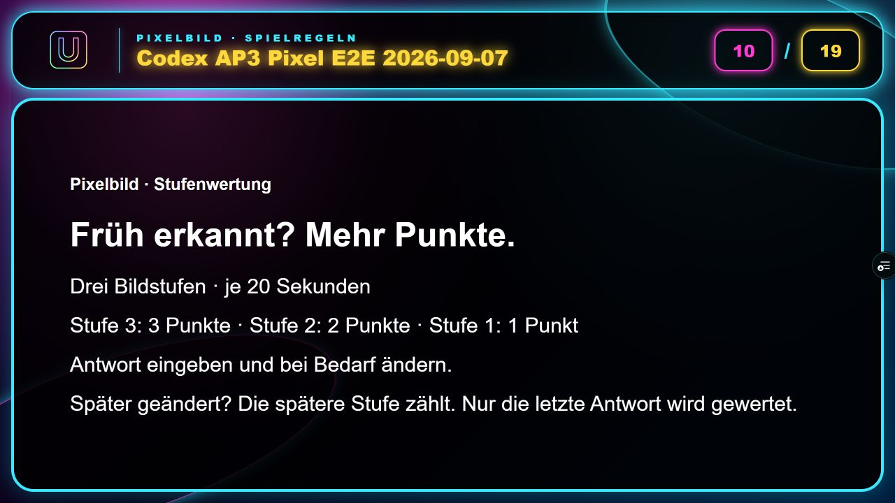
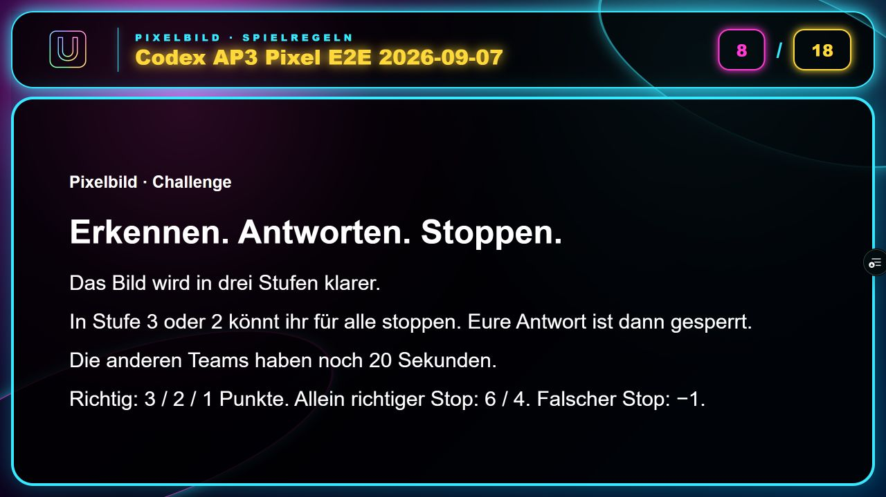
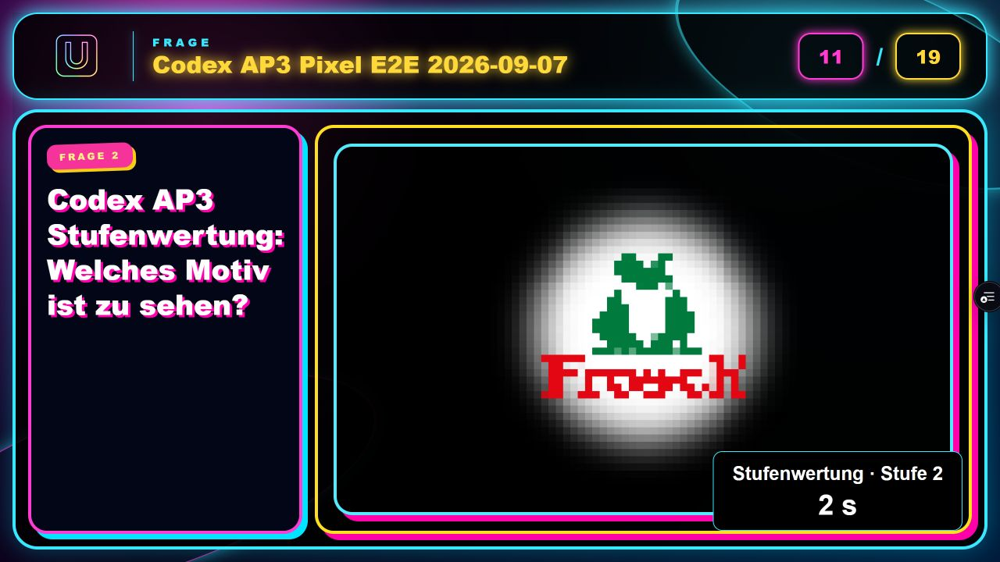
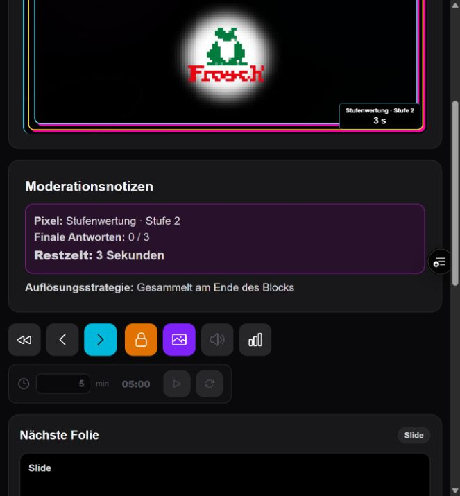
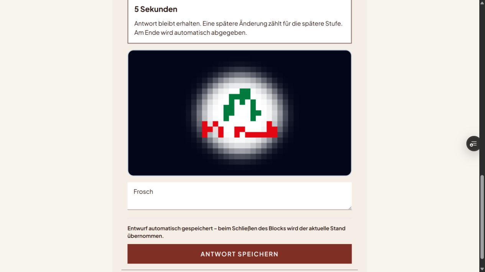
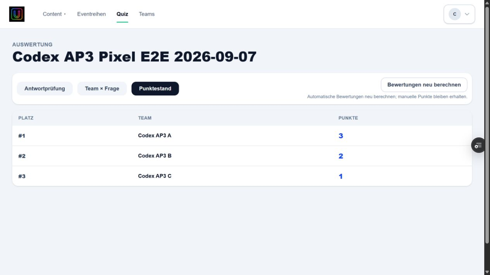
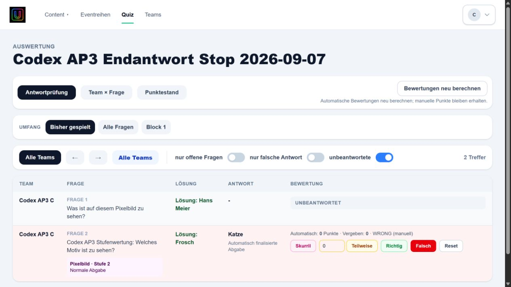

> Historischer AP3-Bericht: Die damalige Begrenzung der letzten Stufe auf 20 Sekunden wird durch B09 ersetzt. Aktueller Vertrag: [Living Specification](../architecture/pixel-question.md). Historische Testergebnisse beschreiben den damaligen Stand.

# AP3 – Pixel-Frage und Stufenwertung

Stand: 7. September 2026. Technische Implementierung, finales Preview-Deployment
und reale Kernabnahme geprüft. Grenzen und separate Befunde sind ausdrücklich genannt.

## Fachlicher Vertrag und Architektur

Ausgangsbasis: Preview 6038b8c (AP2 inklusive kompakter Lifecycle-Leiste).
IST-Analyse, finale Modi, Normalisierung, Invarianten und Zustandsübergänge:
[Living Specification](../architecture/pixel-question.md).

Challenge bleibt der kompatible Default. Konfigurierte Zeiten, Stopper-Sperre,
20 Sekunden Restantwortzeit, 3/2/1 Normalpunkte, exklusiver 6/4-Bonus und −1 bei
falschem Stop bleiben erhalten. Die letzte bisher unbegrenzt offene Challenge-
Phase schließt nun bewusst nach ihrer vorhandenen konfigurierten Dauer.

Stufenwertung hat drei Phasen zu je 20 Sekunden. Die persistierte relevante Stufe
bestimmt bei korrekter finaler Antwort ausschließlich 3/2/1 Punkte. Falsche letzte
Antworten erhalten 0, auch wenn eine frühere Antwort richtig war. Andere Teams
beeinflussen die Punkte nicht. Zentraler Bewertungsstatus, Auswertungen und
Gesamtpunkte verwenden denselben bestehenden Allokator und dieselbe Persistenz.

Keine neue Submission-Engine: Grenzstände liegen in `team_antworten.pixel_stage_history`;
`quiz_interaction_runs.pixel_completed_stages` verhindert wiederholte Verarbeitung.
Beide Felder sind additive Migrationen. Snapshotgrenzen werden vor späteren Writes
unter dem Run-Lock nachgezogen. Der aktuelle Draft bleibt beim Stufenwechsel stehen.
Eine finale Submission entsteht im Stufenmodus beim Close aus dem letzten Stand.
Der Speichern-Button bestätigt nur den Draft. AP2 zählt weiterhin ein Team einmal.

Vergleich: bestehendes NFKC/Trim/Whitespace/Kleinschreibungs-Fingerprint. Leerer
Grenzstand entfernt die Stufenzuordnung; erneute spätere Eingabe erhält die spätere
Stufe. Keine aggressive zusätzliche Textnormalisierung.

## Oberflächen und Lifecycle

Modusauswahl im vorhandenen Pixel-Editor. Erklärung vor jeder Pixel-Frage mit
eigenem NON_QUESTION-Key; öffnet noch keinen Run. Regeltexte liegen in der
Template-Content-Schicht. Generator, Bildstärken und Slots bleiben gleich.

Audience und Moderation zeigen Modus, Bildstufe 3/2/1, Countdown und ggf. Challenge.
Teamformular zeigt die gleiche Zeit, erhält Antworten und verwendet für Pixel-
Aktionen semantische Primärfarben mit Focus/Active/Disabled. Keine allgemeine
Neugestaltung und keine Änderung der kompakten Lifecycle-Steuerung.

Zeitquelle: `opened_at`, konfigurierte Dauern bzw. bestehende Challenge-Deadline.
`serverNow` synchronisiert den Offset; Sekundenticks sind lokal. Keine neue
Polling-Schleife und keine sekündlichen Writes. Nach Leerläufen wird eine fällige
Grenze beim nächsten bestehenden Zugriff nachgezogen, ohne die Frist zu verlängern.

Reload erzeugt keinen Run und keinen Timerstart. Close/Stop finalisiert den
aktuellen Stand; `closed_at` friert die Stufenanzeige ein. AP1 sperrt weitere Writes.
Reset entfernt Zusatzmetadaten zusammen mit bestehenden Drafts/Runs/Sessions.
Bestandsfragen benötigen keine manuelle Datenkorrektur; fehlender Modus bleibt
Challenge. Keine destruktive Migration, kein Production- oder main-Update.

## Technische Prüfung

- Vollständige Testsuite: 1.030 Tests (374 + 507 + 149), 0 Fehler.
- Bestehende Pixel-/Challenge-Punktematrix und AP1/AP2-Regressionen erhalten.
- Neue Tests: Modi/Kompatibilität, A–K-Grenzverläufe, Leeren/Wiederbefüllen,
  unabhängige 3/2/1-Teams, Reload-Zeitgrenzen, Erklär-Slide-Sequenz, beide Regeltexte
  und Countdown-Rendering vor/nach Challenge.
- Editor-Regressionsassertion erweitert um expliziten Challenge-Modus; bestehende
  Werte werden weiterhin geprüft. Keine Tests entfernt.
- TypeScript: erfolgreich. Repositoryweiter ESLint: erfolgreich.
- Prisma-Validierung und Client-Generierung: erfolgreich.
- Production-Build im CI-Modus: erfolgreich; keine Verbindung zu einer Test- oder
  Produktionsdatenbank erforderlich. Erster Aufruf ohne CI scheiterte erwartbar
  an fehlender lokaler Umgebungsdatei im isolierten Worktree.
- `git diff --check`: erfolgreich; reine Generator-Whitespace-Änderungen entfernt.

## Preview-Abnahme

CI, Migration, Deployment und Smoke-Test: erfolgreich (Nachweise unten).
Eigenes Testquiz, bestehende Pixel-Frage und Editor-Persistenz: geprüft.
Challenge: Stufen 3/2, Stop in 2, Restzeit, Sperre und Exklusivbonus 4 geprüft.
Drei Teams mit 3/2/1: Einzelwertung, Gesamtpunkte, Teamauflösung und Podium geprüft.
Zusätzlicher Lauf richtig → falsch: finale Nullwertung geprüft.
Team-/Moderator-/Präsentationsreload während des Stufenlaufs, Stop und Reset geprüft.
Screenshots beider Erklärungen, Audience, Moderation, Teamaktion und Restzeit vorhanden.

### Browserprotokoll – erster Durchlauf

- Eigenes Preview-Quiz **23**, „Codex AP3 Pixel E2E 2026-09-07“, angelegt.
- Bestehende Pixel-Frage 73 unverändert zugeordnet; eigene Stufenfrage **96** mit
  Modus Stufenwertung, Lösung Frosch, Originalbild und drei erfolgreich erzeugten
  Pixelstufen erstellt. Freigabe in Bestandsquizze ausdrücklich vom Nutzer bestätigt.
- Beide Fragen per Drag-and-drop dem Testblock 83 zugeordnet. Ohne Block entsteht
  keine Teaminteraktion; das war zunächst ein unvollständiger Testaufbau.
- Drei getrennte Teamtabs A/B/C angemeldet. Challenge-Erklärung startet keinen Run.
- Challenge: Stufen 3 und 2 sichtbar, A stoppt in 2; Antwort Hans Meier gesperrt,
  B/C erhalten Restzeit. Nach Frist Eingabe deaktiviert. Richtig-Moderation ergibt
  exklusiven Bonus **4**. Screenshot hält Restzeit 7 Sekunden fest.
- Stufenwertung: automatische Wechsel 3 → 2 → 1, Antworten bleiben stehen.
  A wurde im ersten Lauf erst in Stufe 2 gespeichert (Testbedienung zu spät),
  B korrigiert in 2, C antwortet erstmals in 1. Alle werden einmal automatisch
  finalisiert; Moderation zeigt **3/3**, Quote **100 %**.
- Zentrale Richtig-Bewertung ergibt **2/2/1**; Gesamtpunktestand **6/2/1** inklusive
  Challenge. Werte nach erneutem Seitenaufruf bestätigt. Quiz-Lifecycle **Beendet**.
- Gezielter 3/2/1-Wiederholungslauf, Reload während Stufe 2 und richtig → falsch
  bleiben offen. Reset-Dialog vorbereitet; endgültiges Löschen wartet auf Bestätigung.
- Auffälligkeiten: normale Datum-fill-Eingabe erst nach ArrowUp/ArrowDown übernommen;
  Auswertung wechselte nach manueller Bewertung zweimal unerwartet zu /fragen,
  obwohl Punkte gespeichert waren. Ursache noch nicht eingegrenzt; keine Änderung
  außerhalb AP3 vorgenommen. Team-Bildalttext verwendet noch interne Stufennummer.
- Screenshots: ap3-challenge-rules.png, ap3-challenge-residual.png,
  ap3-challenge-moderation.png, ap3-staged-rules.png, ap3-staged-stage.png,
  ap3-staged-moderation.png, ap3-staged-team.png, ap3-first-results.png.

### Zweiter Durchlauf und Negativfall

- Reset von Quiz 23 ausdrücklich bestätigt und durchgeführt: Vorbereitung, Folie 1,
  alte Teamsitzungen ungültig, anschließend neue Anmeldungen mit bestehenden Teamkonten.
- Zweiter Lauf: A Frosch in Stufe 3 unverändert; B Katze in Stufe 3, Frosch in 2;
  C erstmals Frosch in 1. Alle drei Speichern-Aktionen bleiben Drafts. Beim Ende
  genau drei AUTO_FINALIZED-Abgaben. Persistierte Wertungsstufen **3/2/1**.
- Manuelle Richtig-Bewertung zentral: A **3**, B **2**, C **1**. Nach erneutem Laden
  stimmen Einzelprüfung, Punktestand und vollständiges Podium überein.
- Team C zeigt in der Auflösung **1 Punkt**. Moderation zeigt nach Poll **3/3**.
- Moderator, Audience und Team C in Stufe 2 neu geladen; die verstrichene Zeit
  läuft weiter über die Grenze zu Stufe 1, keine neue Frist oder zusätzliche Abgabe.
- Isolierte Kopie Quiz **24**: Frosch in Stufe 3 gespeichert, Teamreload in 2;
  danach Frosch unverändert vorhanden. Die geplante spätere Änderung verpasste wegen
  Browser-/Freigabeprüfungs-Latenz die Frist und zählt ausdrücklich nicht als Negativtest.
- Isolierte Kopie Quiz **25**, „Codex AP3 Endantwort Stop 2026-09-07“, LOVD-Template:
  Frosch in 3 gespeichert, Katze in 2 gespeichert. Quiz während Stufe 1 beendet,
  genau **1/1** finalisiert, Teamansicht gesperrt. Nach Reload und über 60 Sekunden
  später weiterhin Beendet, Stufe 1, Antwortphase beendet.
- Zentrale Endwertung für Quiz 25: **Katze**, Wertungsstufe **2**, **WRONG (manuell),
  0 Punkte**. Die frühe richtige Antwort erzeugt keinen Punkteanspruch.
- Eigene Frage 96 erneut geöffnet: Stufenwertung und 20-Sekunden-Regel persistiert,
  vier Medien vorhanden. Legacy-Frage 73 im neuen Preview geöffnet und unverändert
  spielbar; der bestehende Review-/Berechtigungszustand sperrt ihre Bearbeitung.
- Ergänzende Belege: ap3-staged-stage3.png, ap3-staged-evaluation.png,
  ap3-staged-results.png, ap3-staged-podium.png, ap3-lovd-team.png,
  ap3-lovd-stopped.png, ap3-negative-evaluation.png.

### Grenzen und separate Befunde

- Screenshots prüfen Standard und LOVD bei der vorhandenen Desktopbreite. Kein
  vollständiger zusätzlicher Matrixlauf aller mobilen Breiten und Fokuszustände.
- Challenge-Reload während der kurzen Restzeit nicht separat reproduziert; die
  absolute Deadline ist durch bestehende Regressionen und Stufenreload abgesichert.
- Keine quantitative Netzwerk-/SQL-Profilierung im Browser. Performanceaussagen
  beruhen auf Codeprüfung: bestehendes Polling, lokale Ticks, ein Batch pro Grenze.
- Pixel-Bildalttext verwendete intern 1/2/3. Im Browser gefunden und auf sichtbares
  3/2/1 korrigiert; Typecheck und dateibezogener ESLint danach erfolgreich.
- Bestehender Kopierdialogfehler in Basis 6038b8c bestätigt: „Kopie anlegen“ hat
  type=button ohne Handler, „Abbrechen“ type=submit. Kopie per Enter möglich.
  Außerhalb AP3, nicht verändert.
- Bestehende Ergebnisfolien benötigen nach Änderungen einen Reload, um aktuelle
  Teamwertungen zu übernehmen. Nach Reload korrekte 3/2/1-Darstellung.
- Unerwartete Navigation nach manueller Bewertung zu /fragen mehrfach beobachtet;
  Ursprung nicht abschließend geklärt. Bewertungen nach erneutem Laden kontrolliert.
  Dies sowie initial kurz fehlende Live-Daten nach Reload sind separate UI-Befunde.
- Kein fremdes Quiz verändert. Testquizze 23/24/25 bleiben beendet als Nachweise
  erhalten. Keine Änderungen an main oder Produktion.

### Visuelle Referenzen

| Stufenwertung – Erklärung | Challenge – Erklärung |
| --- | --- |
|  |  |

| Präsentation mit Countdown | Moderation mit Countdown |
| --- | --- |
|  |  |

| Teamaktion im LOVD-Template | Challenge-Restzeit |
| --- | --- |
|  |  |

| Bestätigter Punktestand | Falsche Endantwort |
| --- | --- |
|  |  |

Reproduktion der separaten UI-Befunde: eigenes Quiz öffnen → Quiz kopieren →
Name/Datum eingeben → Kopie anlegen (keine Aktion), Enter im Namensfeld (Kopie).
Auswertung eines eigenen Quiz öffnen → offene Pixelantwort Richtig/Falsch bewerten →
Seitenwechsel zu /fragen wurde mehrfach beobachtet; Rückkehr zur Auswertung zeigt
gespeicherte Bewertung. Ergebnisfolie vor Bewertungsänderung laden → in zweitem Tab
bewerten → Ergebnisfolie bleibt veraltet → Reload lädt korrekte Werte.

## Geänderte Bereiche

Pixel-Konfiguration/Editor, bestehender Interaction-Service mit neuem reinen
History-Helfer, rungebundener Pixel-Allokator, zentrale Bewertung, Slide-Builder,
Slide-Identität/-Titel, produktiver Präsentationsrenderer, Moderation und Teamformular,
gezielte Pixel-Aktionsstyles, additive Prisma-Migration und generierter Client,
Regressionstests, Living Specifications und AGENTS-Verweis.

Commits, Preview-Adresse und Abnahmebelege stehen in diesem Bericht.
Unabhängige Backlog-Befunde wurden dokumentiert, nicht nebenbei behoben.

## Preview-Nachweise

Finale Korrektur: `bd389a299aa81c25577fee5b9d783b0c8f5e8b82`.
[Finales Preview](https://pubquiz-3ziqw9555-just-phil-gud.vercel.app/quiz).
[Deploy Preview #145](https://github.com/justphilgud/pubquiz-web/actions/runs/34116165095):
erfolgreich, inklusive Migration/Deployment/Smoke-Test; Deployment-ID
`dpl_31eeabZFuqqAz3T2PhYnMTooSoj8`, Dauer 2m 29s.
[Preview-CI #139](https://github.com/justphilgud/pubquiz-web/actions/runs/34116013601)
und [Feature-CI #138](https://github.com/justphilgud/pubquiz-web/actions/runs/34116013539)
erfolgreich. Repositoryweiter ESLint meldet keinen Rückstand.
Die reale Abnahme oben erfolgte auf `c101e23`; der einzige spätere Laufzeitunterschied
ist die korrekte sichtbare Stufennummer im Bildalttext. Kein erneuter kompletter
Browserlauf für diese einzeilige Beschriftungskorrektur.

- Laufzeit-Commit: `c101e23a1658570f73a248e196def41ac300313d`.
- [Preview](https://pubquiz-llcm8un8i-just-phil-gud.vercel.app/quiz).
- [Preview-CI #135](https://github.com/justphilgud/pubquiz-web/actions/runs/34107583503): erfolgreich.
- [Feature-CI #136](https://github.com/justphilgud/pubquiz-web/actions/runs/34107583763): erfolgreich,
  einschließlich repositoryweitem ESLint ohne Restfehler.
- [Deployment #141](https://github.com/justphilgud/pubquiz-web/actions/runs/34107766916): erfolgreich,
  3m 6s einschließlich Datenbankidentitätsprüfung, additiver Migration, anschließender
  Migrationsprüfung, Vercel-Build und Smoke-Test.
- Deployment-ID: `dpl_6wuFqMu3a6VxEEVPmm2ySgQtsHQ4`.
- `main` bleibt `e76f57dce19f26488cf9db24b881ab06bf004fd6`; Production unverändert.
- Bestehende nichtblockierende GitHub-Actions-Warnung: checkout/setup-node v4
  deklarieren Node 20, werden auf Node 24 ausgeführt. Kein AP3-Laufzeitfehler.

Die Bestandsfrage #73 wurde auf dem vorigen Preview ausschließlich lesend geöffnet:
Pixel-Template, vier Medien und gespeicherte Lösung vorhanden. Die aktive
Review-/Berechtigungssperre wurde nicht umgangen. Die echte Bestands-/Modusabnahme
auf dem neuen Runtime-Commit ist damit noch nicht ersetzt.

Der neue Preview-Tab zeigt die Anmeldung. Nach Login folgen eigenes Testquiz,
drei Teamverläufe, Verschlimmbesserung, Reload/Stop/Reset, Bewertungsvergleich
und Screenshots. Bis dahin wird keine Browserabnahme als bestanden ausgegeben.

## Dateiliste des geprüften AP3-Stands

- AGENTS.md
- app/fragen/editor/components/PixelStageTimingFields.tsx
- app/fragen/editor/components/QuestionEditor.tsx
- app/fragen/editor/pixelTemplateConfig.ts
- app/fragen/editor/questionTemplateDraft.test.ts
- app/fragen/editor/questionTemplateDraft.ts
- app/fragen/editor/templates/pixelRules.ts
- app/fragen/editor/types.ts
- app/generated/prisma/internal/class.ts
- app/generated/prisma/internal/prismaNamespace.ts
- app/generated/prisma/internal/prismaNamespaceBrowser.ts
- app/generated/prisma/models/quiz_interaction_runs.ts
- app/generated/prisma/models/team_antworten.ts
- app/globals.css
- app/quiz/[quizId]/antworten/QuizAntwortClient.tsx
- app/quiz/[quizId]/moderation/ModerationClient.tsx
- app/quiz/[quizId]/praesentation/buildPraesentationSlides.test.ts
- app/quiz/[quizId]/praesentation/buildPraesentationSlides.ts
- app/quiz/actions.ts
- app/quiz/evaluation/evaluation.server.ts
- app/quiz/interaction/interaction.server.ts
- app/quiz/interaction/pixelLiveInteraction.test.ts
- app/quiz/interaction/pixelLiveInteraction.ts
- app/quiz/interaction/pixelStageHistory.ts
- app/rendering/presentation/PresentationSlideRenderer.test.ts
- app/rendering/presentation/PresentationSlideRenderer.tsx
- app/rendering/presentation/PresentationStorybookQuestionTypes.tsx
- app/rendering/presentation/presentationLiveState.ts
- app/rendering/presentation/presentationSlideMetadata.ts
- docs/architecture/answer-interaction.md
- docs/architecture/pixel-question.md
- docs/architecture/quiz-lifecycle.md
- docs/architecture/submission-live-state.md
- docs/reports/ap3-pixel.md
- prisma/migrations/20260907180000_pixel_stage_history/migration.sql
- prisma/schema.prisma

Code-Commits: e004e0b, 61faad2, c101e23. Letzte Ergänzung: ein parametrisiertes Batch-UPDATE für alle Team-Snapshots einer Grenze; keine Datenbank-Roundtrips je Team. Gezielte Regressionen (34 Tests), Typecheck und ESLint danach erfolgreich. Vollständiger letzter Stand wird zusätzlich durch Preview-CI geprüft.

Abschließender Code-/Abnahmecommit: bd389a2 (Bildalttext plus Browserbelege).
Vollständige finale CI erfolgreich. Spätere Berichts-/Galerieergänzungen liegen nur
im Feature-Branch und lösen kein weiteres Runtime-Deployment aus.
