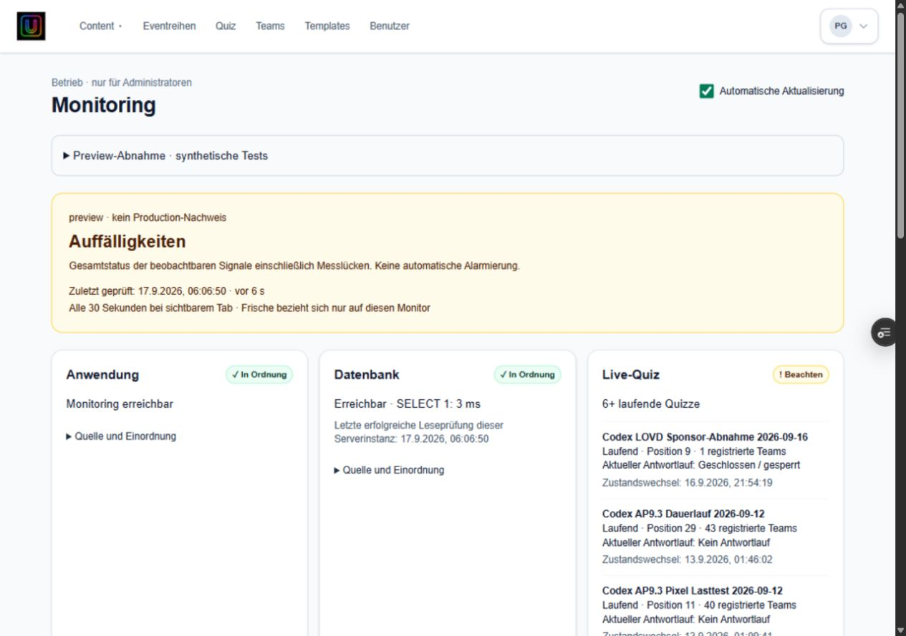
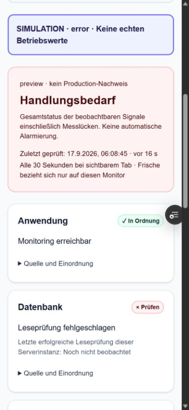

# AP9.5 Monitoring V1 — Implementierungs- und Abnahmestand

## Stand

Eigener Branch `codex/ap95-monitoring-v1`, Basis `bc8625b` (LOVD-Previewstand).
Implementierung: `b3bd44103881ba586da739e0f5e6b12cffa00914`.
Keine Integration nach main. Outro, Sponsor, Quiz-/Antwort-/Bewertungs-/Deadline-
und Operationscode sind gegenüber der Basis unverändert.

Preview: https://pubquiz-et7a5ggly-just-phil-gud.vercel.app/admin/monitoring

Deployment `dpl_3N664j3PEL5VUWerZRzkz9CJGZGo`, READY, exakt obiger Commit,
Target nicht Production. Bestehende Nonprod-Bindings vor Erstellung geprüft;
Medienstore `store_VzfNwjccgkzhc9bi`. Production-Deployment vor und nach Erstellung
unverändert `dpl_3Ufmv6QmvYkp712cPjVPXBDJtsN3`. Keine Environment-/Alias-/Credentialänderung.

## Implementierung

- Bestehende globale Adminrolle, Navigation im Benutzermenü. Editor/Eventmanager ausgeschlossen.
- Anwendung, DB, Live-Quiz, Antworten, Backup, Deployment plus Monitorfrische und lokale Historie.
- Getrennter API-/Collector-/Policy-/UI-Vertrag, reine Regeln für späteren Alarm-Ausbau.
- DB technisch read-only; vorhandener Pool und Indizes, begrenzte aktuelle Quiz-/Runprojektion.
- Keine Telemetrieänderung in fachlichen Saveaufrufen. Fehlende Save-/Clientsignale explizit unbekannt.
- Keine Provider-API oder neue Secrets im laufenden Dashboard, keine Notifications.
- Backup nur datierter kuratierter AP9.4-Nachweis; keine behauptete aktuelle Operationsüberwachung.
- Preview-only, admin-only Szenarien healthy/warning/error/no-quiz, auffällige Simulationskennzeichnung.

Signalquellen, konkrete Regeln/Schwellen, Lastbudget und Persistenz:
[Living Specification](../architecture/monitoring.md).
Bedienweg: [Adminhilfe](../admin-guide/monitoring.md).

## Prüfungen

| Prüfung | Ergebnis |
|---|---|
| Globale Adminrolle zugelassen | Automatisierter Endpointtest erfolgreich |
| Editor, Eventmanager, ungültige Adminzuweisung abgewiesen | Automatisierte Endpointtests erfolgreich, Collector nicht aufgerufen |
| Unangemeldet Seite und API auf echter Preview | Bestehender Proxy führt zum Login; keine Diagnose offengelegt |
| DB gesund / langsam / Fehler, unveränderter Livezustand | Regeltests erfolgreich |
| Kein / aktives Quiz, fehlende Livequelle | Regeltests erfolgreich |
| Saveerfolg/-fehler | Prüfung der Aussagegrenze: persistierter Draft beweist keine Erfolgsquote, Monitorfehler keinen Saveverlust; keine echte Save-Injektion |
| Backupnachweis vorhanden / fehlend | Erfolgreich; historischer Beleg bleibt qualifiziert gelb |
| Grün/Gelb/Rot und Alterung | Erfolgreich; Messlücken verhindern irreführendes Gesamtgrün |
| Secrets / Fehlerunterdrückung | Feste Fehlercodes, SHA-Whitelist, keine Exception-/Credentialweitergabe |
| Cache / konkurrierende Reads / Recovery | Erfolgreich |
| Vollständige npm-test-Suite | 1.120/1.120, davon 13 neue Monitoringtests |
| TypeScript | Erfolgreich |
| ESLint geänderter TS/TSX-Dateien | Erfolgreich, 0 Warnungen |
| Lokaler Production-Build | Erfolgreich mit CI-Dummy-Konfiguration; bestehende Fonts benötigten Netzwerkzugriff |
| GitHub-CI | [35144812742](https://github.com/justphilgud/pubquiz-web/actions/runs/35144812742), completed/success |
| Vercel-Preview-Build | READY |

Keine Production-Lastmessung durchgeführt. Das implementierte Budget beträgt 2–3
SELECTs je tatsächlicher Erhebung plus Auth-/Rollenprüfung und Transaktionssteuerung;
30-s-Browserintervall und 30-s-Cache je Serverinstanz. Das sind **Budget-/Architekturwerte**,
keine behaupteten gemessenen Request-/CPU-/Providerkosten. Cache kann mehrere Polls
bedienen; tatsächliches Erhebungsalter bleibt sichtbar. Keine global verteilte Cachegarantie.

## Browserabnahme abgeschlossen — 17.09.2026

Der Betreiber meldete sich regulär als bestehender Admin an. Keine Rollen-/Authänderung.
Benutzermenü → Monitoring führt nach `/admin/monitoring`. Alle sechs Kacheln lesbar.

| Browserfall | Beobachtung / Ergebnis |
|---|---|
| Echte Preview | Logische Preview und SHA b3bd441 korrekt, Anwendung/DB/Deployment grün |
| Begrenzte Liveprojektion | 6+ RUNNING-Testquizze, Begrenzung korrekt gelb; alte Zustandsänderung nicht als Clientausfall interpretiert |
| Gesunder synthetischer Zustand | DB 24 ms, grüner Livezustand, 12 registrierte Teams / 9 Antwortdatensätze; explizite SIMULATION-Kennzeichnung |
| Warnzustand | DB 900 ms, gelbe DB-Kachel |
| Fehlerzustand | Leseprüfung fehlgeschlagen, DB rot und Gesamtstatus Handlungsbedarf |
| Kein Quiz | „Kein Quiz aktiv“, Live-Kachel grün |
| Rückkehr zur Messung | Simulation verschwindet; echte Quizdaten und Release erneut sichtbar |
| Ereignisse | Szenariowechsel getrennt als Simulation, roter Fehler und Rückkehr sichtbar |
| Desktop | 1280 × 900 CSS-Pixel, scrollWidth 1265, kein horizontaler Überlauf; drei Kachelspalten |
| Smartphone | 390 × 844 CSS-Pixel, scrollWidth 375, kein horizontaler Überlauf; einspaltig, Auswahl und Schalter nutzbar |
| Geheimnisschutz | Keine Credential-/Connectionstring-/Hashmuster im sichtbaren Dashboard; keine Antwortinhalte/Teamnamen |
| Pause / Veraltung / Wiederaufnahme | Bei pausierter Aktualisierung blieb die Erhebung 06:07:20 erhalten; nach 81 s korrekt „Zustand veraltet“ und Anwendung gelb. Anschließend automatische Aktualisierung und echte Datenquelle wiederhergestellt |

Die Tests healthy/warning/error/no-quiz verändern keine Fachdatensätze. Der gesunde
Test bleibt insgesamt bewusst gelb wegen der tatsächlichen Messlücken. Es wurde kein
fiktiver gesamthaft grüner Productionzustand zur Abnahme eingeführt.

### Gemessene Last, echte Preview (kleine Browserstichprobe)

- SELECT-1-Probe: **3 ms** in beiden protokollierten Erhebungen.
- Collector: **26 ms und 16 ms**, jeweils **3 SELECTs**, ohne Auth-/Rollenprüfung und
  Transaktionssteuerung. Sechs Quizze mit den aktuellen Run-Aggregaten ausgegeben.
- Browserrequests: **212 ms, 161 ms (Cacheantwort), 119 ms**.
- JSON-Nutzdaten: jeweils **1.727 Byte unkomprimiert**.
- Cacheantwort um 06:06:17 Europe/Berlin behielt korrekt die Erhebung 06:05:45 bei;
  Antwortzeit wurde nicht als neue DB-Messung ausgegeben. Weitere Erhebung 06:06:50.
- Keine zusätzliche Providerabfrage. Keine Productionmessung, kein CPU-/Kosten-/p95-
  oder Kapazitätsnachweis aus diesen wenigen Beobachtungen abgeleitet.

### Screenshots

### Abschlussbewertung

**AP9.5 Monitoring V1 auf Preview abgenommen: Ja**, innerhalb der ausdrücklich
dokumentierten V1-Messgrenzen. Keine neue Produktkorrektur während der Browserabnahme
erforderlich. Code-/Build-/Typecheck-/Lint-/Testnachweise unverändert. Dokumentations-CI
[35145477922](https://github.com/justphilgud/pubquiz-web/actions/runs/35145477922) ebenfalls
erfolgreich. Abschließende lesende Providerprüfung am 17.09. bestätigt unverändertes
Production-Deployment. Die V1-Abnahme schließt keine offenen AP9.4-Kriterien und keine
V2-Telemetrie-/Alarmierungsanforderungen.

## V2

Schwellen an der Generalprobe kalibrieren; zentrale Save-/Retry-/Fehlertelemetrie mit
getrennten Transport- und fachlichen Ergebnissen; Clientempfang/Acks; aktueller geprüfter
Backupstatus; unabhängiger Außencheck; persistierte Historie; danach gesondert freigegebene
E-Mail-/Provideralarmierung. Nichts davon vorab aktiviert. Keine Backupautomatisierung
oder Retention verändert.
