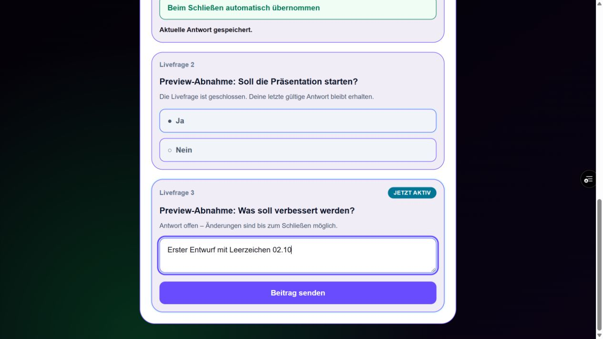
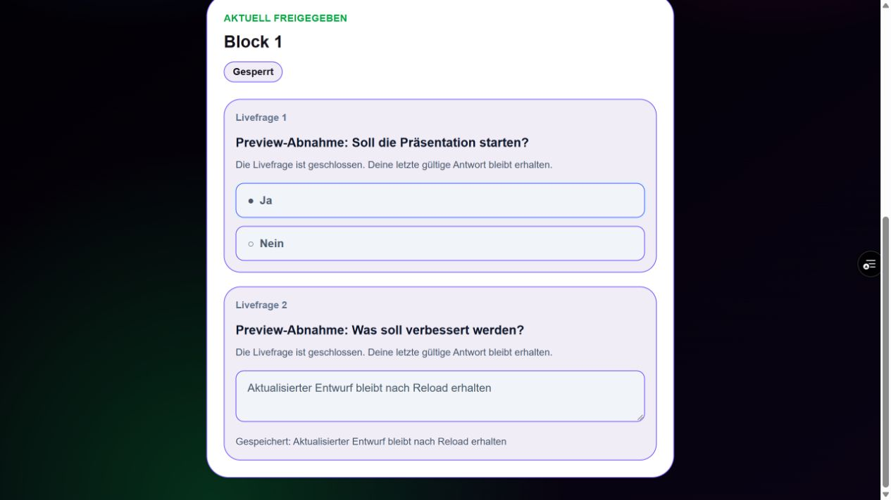

# Offene Livefrage – Fix und Preview-Abnahme (02.10.2026)

## Stand

- Feature-Commit: `d59eca62d1e536357e23759d4a64e3205193209a`
- Draft-PR gegen `main`: [#81](https://github.com/justphilgud/pubquiz-web/pull/81)
- Preview-PR: [#82](https://github.com/justphilgud/pubquiz-web/pull/82)
- Preview-Merge: `0e9d1e3006991411052499dac24bf9890ebde78b`
- Preview-Deploy-Run: [37004760247](https://github.com/justphilgud/pubquiz-web/actions/runs/37004760247)
- Deployment-ID: `dpl_7BdnhAkXbzYdp91R2TtimPAg3KA9`
- Unveränderliche Preview: https://pubquiz-650330pr8-just-phil-gud.vercel.app
- Authentifizierte Branch-Preview: https://pubquiz-web-git-preview-content-and-quiz-flow-just-phil-gud.vercel.app
- Testquiz: `#75 – TEST – Offene Livefrage Fix Minimal 02.10.2026`

`main` blieb auf `bff3a8ccd47928df14f7452b6f91fb8faaf2c0c9`. Production und produktive Daten wurden nicht verändert.

## Ursache

Drei zusammenhängende Laufzeitlücken verursachten das fehlerhafte Verhalten:

1. Der Blockschluss suchte ausschließlich fragegebundene Interaction-Runs. Content-Livefragen besitzen stattdessen eine Ablauf-Element-Zuordnung und blieben dadurch offen.
2. Der Teilnehmer-Write war nicht an die konkret angezeigte Run-ID gebunden. Ein veralteter Client konnte seinen Request gegen einen inzwischen anderen aktuellen Run senden.
3. Der Teilnehmerstatus lud freigegebene Livefragen nur während eines offenen Blocks. Nach Blockschluss verschwand deshalb die letzte eigene Antwort; die aktive Freitextdarstellung verwendete außerdem lokalen statt persistierten Text.

## Änderung

- `saveLivePollResponse` verlangt die angezeigte `interactionRunId` und prüft sie innerhalb derselben Sperrtransaktion gegen den aktuellen Run. Abweichung oder geschlossener Run liefert fail-closed `LIVE_STATE_CHANGED`.
- `closeBlockInteractions` schließt sowohl fragegebundene Runs als auch Content-Livefragen des Blocks.
- Der Teilnehmerstatus lädt weiterhin nur den aktuellen bzw. zuletzt freigegebenen Block, hält dort aber die eigenen freigegebenen Livefrage-Antworten nach Blockschluss sichtbar.
- Die Teilnehmerkarte zeigt im geschlossenen Zustand den persistierten Text und sperrt sämtliche Eingaben.
- Bestehende Speicherung, Sanitizing, Moderationssicht, Reihenfolge und Antworttabellen bleiben unverändert.

## Automatisierte Prüfung

- Gezielte Livefrage-, Sequenz- und Lifecycle-Regression: 42/42 grün.
- Nachgelagerte Suite: 184/184 grün.
- TypeScript: grün.
- ESLint der geänderten TS/TSX-Dateien: grün.
- Prisma-Validierung: grün.
- Production-Build: grün.
- `git diff --check`: grün.
- CI für Feature- und Preview-PR sowie Preview-Branch: grün.
- Vollständige `npm test`-Suite: 682/683. Der einzige Fehler ist ein vorbestehender Hash-Mismatch in `productionImportArchitecture.test.ts`; weder Test noch versionierter Importplan wurden durch diesen Fix geändert.

Die Regression deckt zusätzlich ab: zukünftige Livefragen bleiben aus Payload/UI verborgen, veraltete Run-IDs werden abgewiesen, ein geschlossener Run akzeptiert keinen weiteren Write, reguläre Fragen bleiben additiv und der Blockschluss erfasst Content-Livefragen.

## Authentifizierter Browser-Smoke

Testquiz #75 enthält eine reguläre Frage, eine Auswahl-Livefrage und eine Freitext-Livefrage.

- Reguläre Antwort blieb während der Livephase sichtbar und gespeichert.
- Geschlossene Auswahl-Livefrage behielt die eigene Auswahl sichtbar und gesperrt.
- Freitextfeld war während `OPEN` sichtbar, aktiviert und editierbar.
- Erster Entwurf wurde gespeichert; eine zweite Fassung ersetzte ihn nach bestehender Draft-Logik.
- Reload stellte die zweite Fassung wieder her und ließ sie während `OPEN` weiter editierbar.
- Moderation zeigte den aktuellen Draft und genau eine Antwort.
- Blockschluss schloss die Content-Livefrage. Nach Reload war die letzte Fassung sichtbar und das Textfeld deaktiviert.
- Später Client-Write und falsche Run-ID werden serverseitig durch die neue Regression mit `LIVE_STATE_CHANGED` abgewiesen.
- Teilnehmer- und Moderationskonsole: keine Fehler.

Die Testumfrage verwendet den bestehenden Veröffentlichungsmodus `AUTOMATIC`; die öffentliche Darstellung zeigt daher ausschließlich die dafür vorgesehene bereinigte Projektion. Identität und Originaltext bleiben auf die Moderation beschränkt. Die vorhandenen Projektionstests für `MODERATED` bleiben grün.

### Bearbeitbare offene Livefrage

### Nach Blockschluss sichtbare, gesperrte Antwort

## Abgrenzung

Keine Dependency, keine Migration, keine Änderung an Meme-, Design- oder AP2–AP4-Logik. Draft-PR #81 bleibt bis zur gesonderten Freigabe unintegriert.
