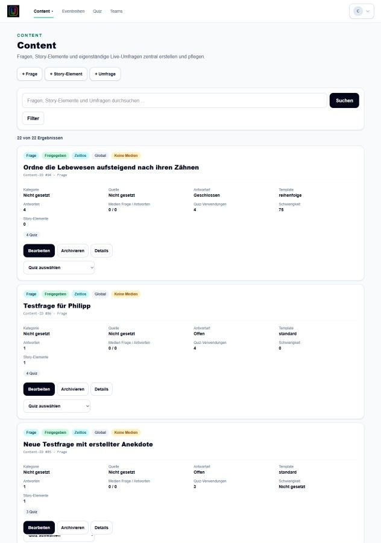

# Content erstellen und finden

Unter **Content** werden Fragen, Story-Elemente und Umfragen gemeinsam verwaltet. Das Content-Untermenü im Header führt direkt zur Übersicht oder zu einer neuen Frage, Story beziehungsweise Umfrage.

## Suchen und filtern

1. **Content** öffnen.
2. Einen Suchbegriff eingeben.
3. Über den Inhaltstyp zwischen Fragen, Story-Elementen und Umfragen filtern.
4. Den Treffer öffnen oder über die direkte Erstellen-Aktion einen neuen Inhalt anlegen.

## Story-Elemente

Story-Elemente sind eigenständige redaktionelle Inhalte ohne Antwort und ohne Punkte. Sie können einem Quiz zugeordnet und dort wie andere Inhalte positioniert werden.

## Umfragen

Umfragen sind ebenfalls eigenständige Content-Elemente. Sie erzeugen keine Bewertung, keine Punkte und keine Quizlösung.

- **Auswahlumfrage:** zeigt nach der Freigabe ein anonymes Barometer.
- **Freitextumfrage:** zeigt freigegebene, bereinigte Texte als Wall.
- **Automatische Veröffentlichung:** geeignete Antworten erscheinen nach dem Schließen entsprechend der Konfiguration.
- **Moderierte Veröffentlichung:** die Moderation gibt einzelne Texte frei.
- **Replacement Rules:** ersetzen konfigurierte Begriffe ausschließlich in der öffentlichen Fassung; das Original bleibt intern erhalten.

Der Lauf folgt **OPEN → CLOSE**. Während OPEN kann abgestimmt werden; nach CLOSE ist die Eingabe gesperrt.
