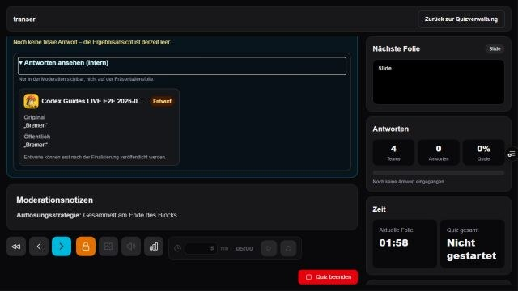

# Quiz moderieren

Die Moderationsansicht zeigt die aktuelle Präsentation, die nächste Folie, Notizen, Teamstatus, Timer und die zugehörigen Live-Steuerungen.

## Quiz-LIVE

1. Die LIVE-Frage öffnen. Das Publikum sieht ausschließlich die Frage.
2. Unter **Antworten ansehen (intern)** die gespeicherten Teamantworten kontrollieren.
3. Während OPEN tragen aktuelle Autosaves den Status **Entwurf**. Änderungen ersetzen die vorige Draft-Anzeige und werden nicht doppelt gezählt.
4. Bei Freitext werden Original und bereinigte öffentliche Fassung getrennt dargestellt. Ein Entwurf kann noch nicht veröffentlicht werden.
5. **Antwortphase schließen** finalisiert inhaltlich gefüllte Drafts. Leere Drafts erzeugen keine Antwort; es erfolgt keine automatische Bewertung allein durch CLOSE.
6. Der Status wechselt zu **Final**. Erst jetzt kann über **Ergebnis anzeigen** die anonyme Auswahlverteilung oder eine freigegebene Textauswahl veröffentlicht werden.
7. Die Lösung bleibt ein eigener Präsentationsschritt.

LIVE-Drafts sind Moderationsdaten. Sie erscheinen weder in der Publikumspräsentation noch in einer öffentlichen Verteilung oder Text-Wall.

## Umfragen und Zwischenstände

Content-Umfragen verwenden ebenfalls OPEN und CLOSE, bleiben aber ohne Punkte. Bei Freitext entscheidet die konfigurierte automatische oder moderierte Veröffentlichung. Der öffentliche Zwischenstand ist anonym und enthält nur Rang und Punkte; die Moderationsansicht behält die Teamidentität.
