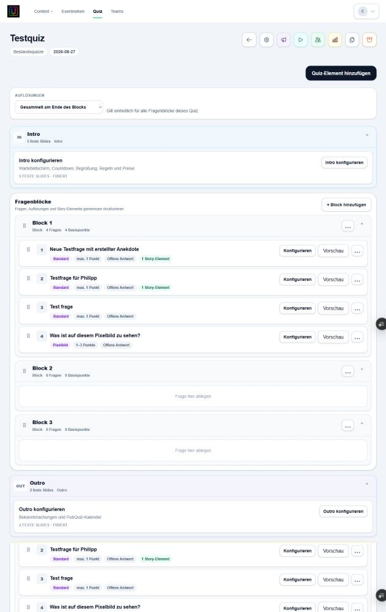

# Quiz verwalten

Quizze können erstellt, kopiert und archiviert werden. Der Editor bildet den Ablauf als **Intro → Blöcke → Outro → Kein Block** ab.

## Gemischte Inhalte

Ein Quiz kann drei eigenständige Inhaltstypen enthalten:

- Fragen mit Antwort, Lösung und optionaler Bewertung;
- Story-Elemente ohne Antwort;
- Umfragen ohne Punkte und Bewertung.

Über **Quiz-Element hinzufügen** werden bestehende Inhalte zugeordnet. Die Karten lassen sich per Drag-and-drop innerhalb der erlaubten Bereiche sortieren. **Kein Block** sammelt bereits zugeordnete, aber noch nicht in einen Fragenblock eingeordnete Inhalte. Polls werden wie andere Quiz-Elemente an ihrer gespeicherten Position abgespielt.

Intro und Outro besitzen feste, separat konfigurierbare Slides. Fragenblöcke steuern zusätzlich, ob Lösungen direkt oder gesammelt am Blockende gezeigt werden.
