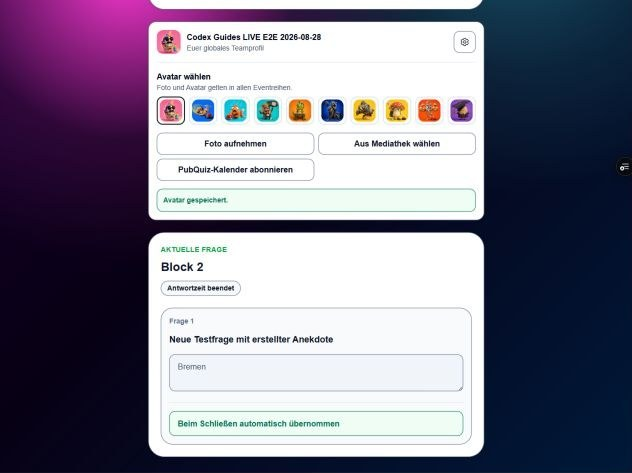

# Teams und Teilnahme

Ein Team ist eine globale Identität und kann mit demselben Teamnamen und Zugangswort an Quizzen verschiedener Eventreihen teilnehmen. Ein bestehender Teamname verlangt das bestehende Team-Passwort; bei korrektem Passwort wird dieselbe Team-ID verwendet und keine Dublette angelegt.

Ein neues Team erhält ein leicht kommunizierbares Zugangswort aus der vorhandenen Wortliste. Ergebnisse und Wertungen bleiben trotz globaler Identität dem jeweiligen Quiz und seiner Eventreihe zugeordnet.

Archivierte Teams können nicht neu beitreten. Bei vergessenem Zugangswort können Administrator oder zuständiger Eventmanager das bestehende Wort gezielt anzeigen oder ändern.

Nach einem Verbindungsabbruch stellt die signierte Quiz-Session die Teilnahme im selben Browser wieder her.

Nach jedem erfolgreichen Join kann das Team sein globales Profil sehen und optional ändern: Foto aufnehmen, ein Bild aus der Mediathek wählen oder einen der zehn Systemavatare auswählen. Ohne eigenes Foto bleibt ein stabiler Avatar sichtbar. Eine durch die Verwaltung gesetzte Upload-Sperre verhindert neue Fotos, nicht aber die Avatar-Auswahl. Archivierte Teams können ihr Profil nicht über den Join verändern.

Die Avatarauswahl wird über die Profileinstellungen geöffnet und bleibt kompakt. Ein gewählter Avatar gilt global und bleibt nach einem Reload erhalten. Ein eigenes Teamfoto hat in Teamlisten, Moderation und Präsentation Vorrang. Wird es entfernt, erscheint wieder der gespeicherte Avatar.
